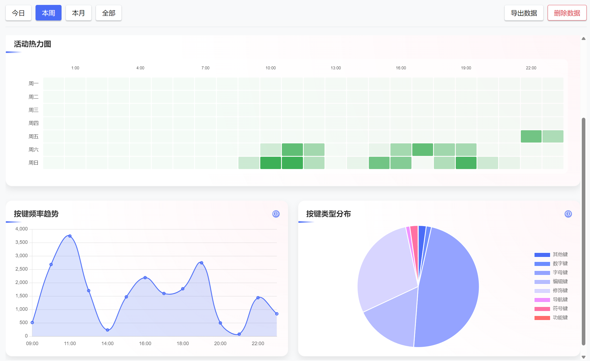
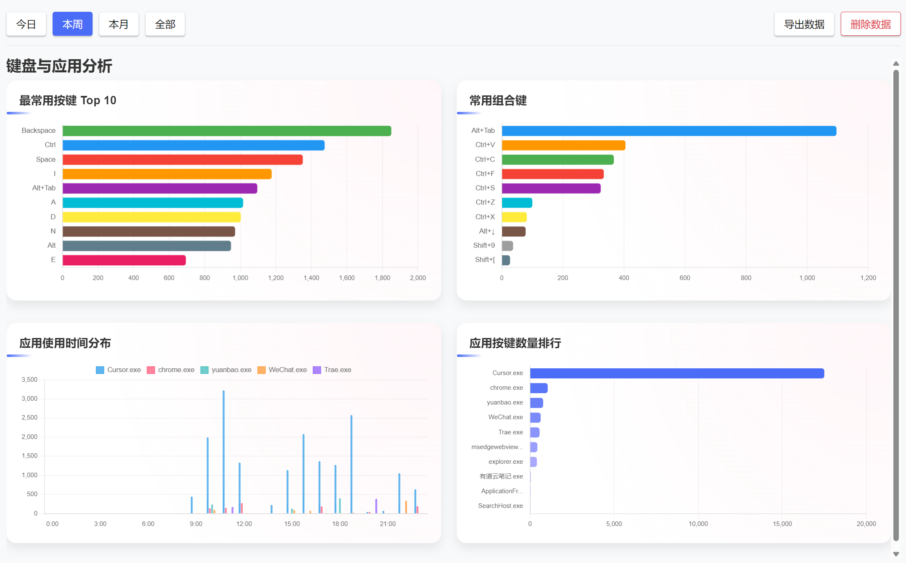
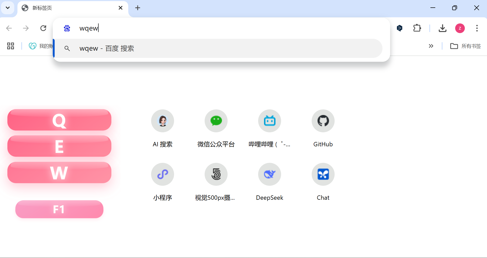

# 按键统计 (Keyboard Statistics)

<div align="center">
  
  <p>记录、分析和可视化您的键盘使用情况，提升工作效率和健康意识</p>
</div>

## ✨ 特性亮点

- **实时按键监控** — 自动记录每个按键，提供实时KPM(每分钟按键数)指标
- **直观数据可视化** — 通过热力图、趋势图、饼图等多种图表直观展示您的键盘使用情况
- **应用程序分析** — 了解在不同应用中的键盘使用频率，识别您的主要工作应用
- **按键分布分析** — 查看最常用按键和组合键，优化您的工作流程和快捷键设置
- **完全离线使用** — 所有数据仅在本地存储，保护您的隐私
- **轻量级且高效** — 极低的系统资源占用，几乎不影响系统性能
- **自定义设置** — 包括键盘弹窗位置调整、界面主题切换等多种自定义选项

## 🚀 快速开始

### 下载与安装

1. 从[Releases页面](https://github.com/yourusername/keyboard-statistics/releases)下载最新版本
2. 运行安装程序，按照提示完成安装
3. 启动应用，开始记录您的键盘使用数据

### 主要功能

- **仪表盘** — 查看总览数据，包括总按键数、平均KPM、活动热力图等
- **键盘与应用分析** — 深入了解您的按键习惯和应用使用情况
- **设置** — 自定义应用行为，包括开机自启动、数据位置和按键弹窗设置

## 📊 数据洞察

通过按键统计，您可以获得关于您的打字习惯的宝贵洞察：

- 了解您的高峰工作时段和低效时间
- 发现最频繁使用的按键和组合键
- 识别可能导致重复性劳损的模式
- 分析不同应用程序中的键盘使用差异

## 🛠️ 开发者信息

### 构建项目

本项目使用Tauri框架开发，结合了Rust后端和Web前端技术。

```bash
# 安装依赖
npm install

# 开发模式运行
npm run tauri dev

# 构建可执行文件
npm run tauri build
```

### 技术栈

- **前端**: HTML, CSS, JavaScript, Chart.js
- **后端**: Rust, Tauri
- **数据存储**: SQLite

## 📝 待办功能

- [ ] 高级数据分析和报告导出
- [ ] 更多自定义主题
- [ ] 键盘热度图(展示键盘上的使用频率)
- [ ] 多语言支持

## 🔒 隐私声明

本应用完全离线运行，所有数据仅存储在您的本地设备上，不会进行任何网络传输或远程数据收集。

## 📷 更多截图

<div align="center">
  
  
</div>

## 📄 许可证

MIT License © 2025 Program-Rookie

---

<div align="center">
  <p>如果您觉得这个项目有用，请考虑给它一个⭐Star支持！</p>
  <p>有问题或建议？请<a href="https://github.com/yourusername/keyboard-statistics/issues">提交Issue</a>或联系开发者</p>
</div>